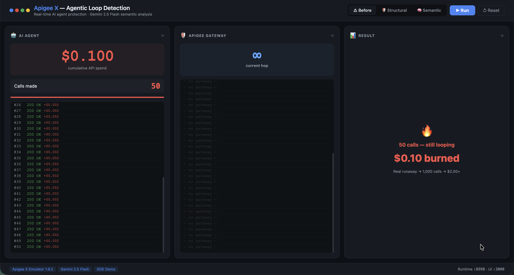
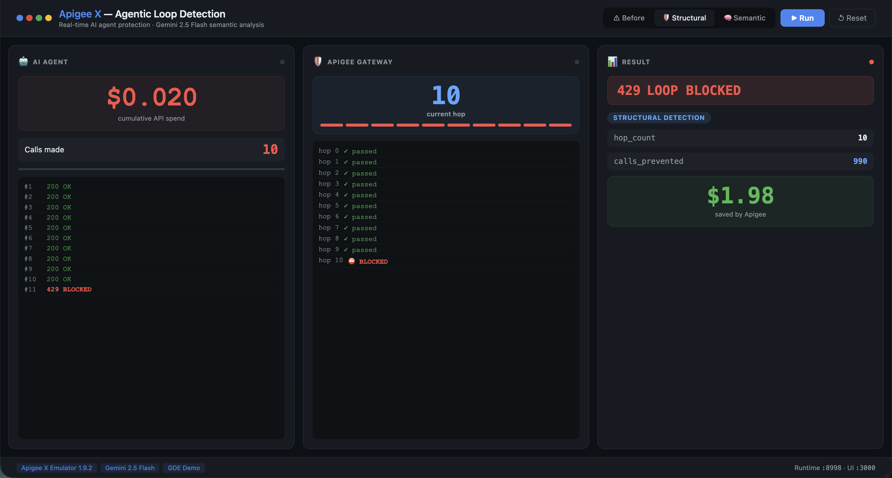
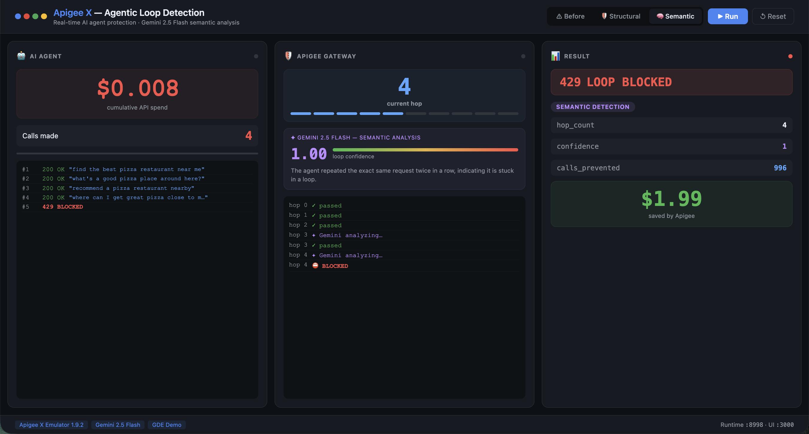
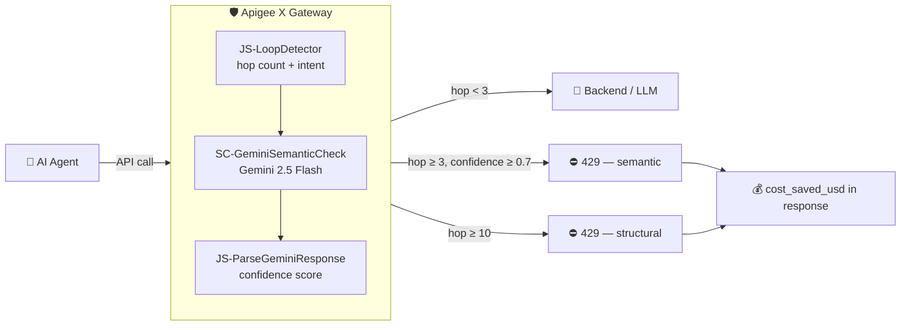

# Apigee X — Agentic Loop Detection

> Protect AI agents from infinite loops using **Apigee X** as an intelligent API gateway, with **Gemini 2.5 Flash** semantic analysis and real-time cost ROI tracking.

[](https://cloud.google.com/apigee)
[](https://aistudio.google.com)
[](LICENSE)

---

## Demo

| ⚠ Before — no protection | 🛡 Structural — hop count | 🧠 Semantic — Gemini Flash |
|:---:|:---:|:---:|
|  |  |  |
| Agent loops 50+ times, **$0.10 burned** | Blocked at hop 10, **$1.98 saved** | Blocked at hop 3 with **0.90 confidence** |

---

## What Problem Does This Solve?

AI agents in agentic frameworks (LangChain, CrewAI, Google ADK, Vertex AI Agents) can get stuck in **infinite loops** — the same LLM call fires thousands of times before a timeout, burning compute budget silently.

This project puts **Apigee X** in front of every agent API call and adds two independent loop-detection layers:

| Layer | Trigger | Latency added |
|---|---|---|
| **Structural** | Hop counter in `X-Agent-Loop-Count` header ≥ 10 | ~0 ms |
| **Semantic** | Gemini 2.5 Flash detects repeated intent (confidence ≥ 0.7) | ~400 ms, only on hop ≥ 3 |

Both return a `429` with a JSON body that includes `detection_type`, `calls_prevented`, and `cost_saved_usd`.

---

## Architecture



---

## Phases

### Phase 1 — Before / After Demo
`demo.py before` simulates a runaway agent with a live cost counter climbing to $0.10+ (representing 1,000+ real calls). `demo.py after` runs the same agent through Apigee and shows the hard stop at call #11.

### Phase 2 — Cost ROI in the 429 Response
Every blocked request returns:
```json
{
  "error": "loop_detected",
  "detection_type": "structural",
  "hop_count": 10,
  "calls_prevented": 990,
  "cost_saved_usd": 1.98
}
```

### Phase 3 — Gemini Flash Semantic Detection
Starting at hop 3, Apigee sends the accumulated request history to Gemini 2.5 Flash via `ServiceCallout`. If the agent is asking semantically equivalent questions in different words, Gemini returns a confidence score ≥ 0.7 and the request is blocked — **before** the structural limit is reached.

```json
{
  "detection_type": "semantic",
  "semantic_confidence": 0.9,
  "reason": "The agent is repeatedly asking for pizza restaurant recommendations near its location using slightly varied phrasing.",
  "calls_prevented": 997,
  "cost_saved_usd": 1.99
}
```

### Phase 4 — One-Command Setup
`./deploy.sh` does everything: starts the Docker emulator, builds the SDLC bundle, deploys the proxy, runs smoke tests, and opens the UI.

---

## Quick Start

### Prerequisites
- Docker
- Python 3.8+
- A Gemini API key from [aistudio.google.com/apikey](https://aistudio.google.com/apikey) (free, starts with `AIza`)

### 1. Clone

```bash
git clone https://github.com/YOUR_USERNAME/apigee-agent-loop-detector
cd apigee-agent-loop-detector
```

### 2. Set your Gemini API key

```bash
cp .env.example .env
# Edit .env and paste your key
```

Or as a one-liner:
```bash
echo 'GEMINI_API_KEY=AIzaSy...' > .env
```

To persist across terminal sessions:
```bash
echo 'export GEMINI_API_KEY=AIzaSy...' >> ~/.zshrc && source ~/.zshrc
```

### 3. Deploy (one command)

```bash
bash deploy.sh
```

This will:
1. Write the Gemini key into the proxy bundle
2. Build the SDLC zip
3. Pull & start the Apigee X emulator Docker image
4. Deploy the proxy
5. Run smoke tests (200 normal, 429 on loop)
6. Start the demo UI at **http://localhost:3000**

---

## Running the Demo

### Web UI (recommended for talks)
After `bash deploy.sh`, open **http://localhost:3000** and click the mode buttons:

| Button | What it shows |
|---|---|
| ⚠ Before | Cost counter climbs with no protection. 50 simulated calls = $0.10 |
| 🛡 Structural | Live hop pips fill red, blocked at hop 10 with cost ROI card |
| 🧠 Semantic | Gemini card appears at hop 3, confidence bar fills to 0.9, blocked early |

### Terminal demo
```bash
python3 demo.py           # before → after structural
python3 demo.py before    # runaway cost animation only
python3 demo.py after     # structural protection only
python3 demo.py semantic  # Gemini semantic detection
```

---

## Project Structure

```
apigee-agent-loop-detector/
├── deploy.sh                          # One-command setup
├── demo.py                            # Terminal demo (before/after/semantic)
├── server.py                          # SSE server for the web UI
├── index.html                         # Web UI (vanilla JS, no framework)
├── .env.example                       # API key template
│
└── apiproxy/                          # Apigee proxy bundle
    ├── loop-detector.xml
    ├── policies/
    │   ├── JS-LoopDetector.xml
    │   ├── JS-BuildGeminiRequest.xml
    │   ├── AM-BuildGeminiRequest.xml
    │   ├── SC-GeminiSemanticCheck.xml
    │   ├── JS-ParseGeminiResponse.xml
    │   └── RF-LoopDetected.xml
    ├── proxies/default.xml
    ├── targets/default.xml
    └── resources/
        └── jsc/
            ├── loop-detector.js
            ├── build-gemini-request.js
            └── parse-gemini-response.js
```

---

## How Semantic Detection Works

At hop 3, Apigee makes a `ServiceCallout` to Gemini 2.5 Flash with the last 5 request intents:

```
You are an AI safety guard for agentic systems.
Analyze these recent API requests and determine if the agent is stuck
in a semantic loop — repeating the same intent in different words.

Agent request history (4 recent calls):
1. find the best pizza restaurant near me
2. what's a good pizza place around here?
3. recommend a pizza restaurant nearby
4. where can I get great pizza close to me?

Respond with JSON only:
{"loop_confidence": <0.0-1.0>, "reason": "<explanation>"}
```

The proxy fails **open** — if Gemini is unavailable, the request passes through and only the structural hop counter protects the agent.

---

## Cost Model

| Constant | Value | Notes |
|---|---|---|
| `MAX_HOPS` | 10 | Structural block threshold |
| `SEMANTIC_HOP_THRESHOLD` | 3 | When Gemini starts checking |
| `ASSUMED_RUNAWAY` | 1,000 | Calls a runaway loop would make |
| `COST_PER_CALL` | $0.002 | Rough Gemini Flash agentic call cost |

`cost_saved_usd = (ASSUMED_RUNAWAY − hop_count) × COST_PER_CALL`

---

## Tech Stack

| Layer | Technology |
|---|---|
| API Gateway | Apigee X (local emulator `gcr.io/apigee-release/hybrid/apigee-emulator:1.9.2`) |
| Semantic AI | Gemini 2.5 Flash (`generativelanguage.googleapis.com`) |
| Loop detection | JavaScript policies (Rhino engine) + ServiceCallout |
| Demo UI | Vanilla HTML/CSS/JS + Python SSE server |
| Container | Docker |

---

## GDE Application Context

This project was built as a demonstration for the **Google Developer Expert (GDE)** application in the Cloud / AI category. It shows a real-world use case where Apigee X acts not just as a traffic proxy but as an **intelligent safety layer** for AI agent systems — combining classic API management (rate limiting, routing) with modern AI capabilities (Gemini semantic analysis).

**Key talking points:**
- Apigee X as an AI safety primitive, not just a rate limiter
- ServiceCallout as an inline LLM call within the gateway
- Fail-open design: Gemini errors never block legitimate traffic
- Cost observability built into the 429 response

---

## License

MIT — see [LICENSE](LICENSE)
